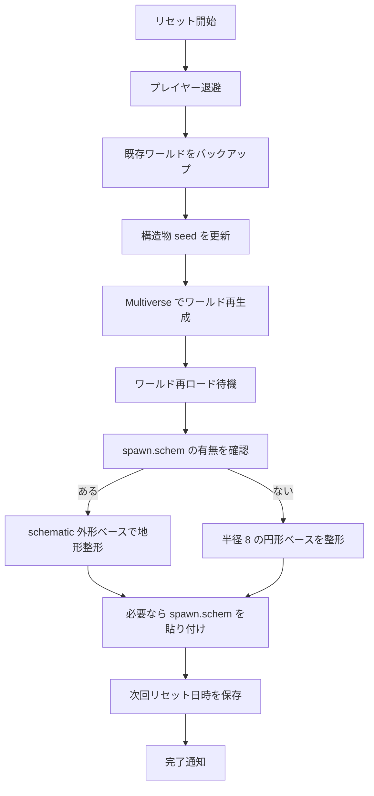
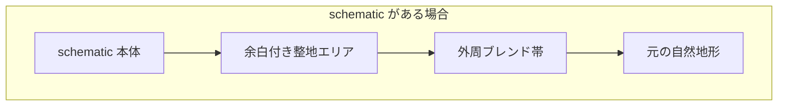

# 資源ワールド Schematic 運用マニュアル

## 1. この資料の目的

この資料は、資源ワールドのリセット時に使う `spawn.schem` の配置方法と、リセット時に地形がどう整形されるかを順番に説明するものです。

対象は次の2パターンです。

- `spawn.schem` がある場合
- `spawn.schem` がない場合

## 2. schematic の配置場所

- 配置先: `plugins/T-Nexus/schematics/<worldName>/spawn.schem`
- 例: `plugins/T-Nexus/schematics/resource/spawn.schem`

## 3. リセット全体の流れ



## 4. schematic がある場合の流れ

### 4-1. 何をしているか

`spawn.schem` が存在する場合、T-Nexus は最初に schematic の外形を読みます。  
そのうえで、建物本体の周囲だけを整地し、さらに外周を自然地形へなめらかにブレンドします。
貼り付け時は schematic 内の通常 `AIR` を直接ワールドへ書き込みません。

### 4-2. イメージ



### 4-3. 実際の挙動

1. schematic のサイズと原点を読み取る
2. schematic の周囲に少し余白を足した範囲を整地する
3. その外側を自然地形へ向けて段階的にブレンドする
4. 最後に `(0, surfaceY, 0)` を基準に schematic を貼る
5. air marker block が含まれている場所だけ、貼り付け後に `AIR` へ置換する

## 5. schematic がない場合の流れ

### 5-1. 何をしているか

`spawn.schem` が無い場合でも、リセットは失敗しません。  
代わりに `(0, 0)` を中心とした半径 `8` の円形ベースを作り、その外周を自然地形へブレンドします。

### 5-2. イメージ


### 5-3. 実際の挙動

1. ワールド中心付近の地表高さを基準にする
2. 半径 `8` の円形ベースを整地する
3. その外側を自然地形へ向けてブレンドする
4. schematic は貼らない

## 6. schematic 作成時に気を付けること

### 6-1. 原点

- `(0, 0, 0)` をスポーン基準点として扱ってください
- schematic の原点は、リセット後の地表に合わせたい位置へ置いてください
- つまり、schematic 化するときに「ここを地表高さに合わせたい」と考える立ち位置を origin にしてください
- T-Nexus はその origin を `(0, surfaceY, 0)` へ貼るため、schematic 作成時の立ち位置がそのまま最終的な基準高さになります

### 6-2. 建物の周辺余白

- 建物の壁や階段がブレンド帯に干渉しないよう、少し余白を持たせてください
- 張り出し装飾や外周床がある場合は、地形となじませたい境界を意識して作ってください

### 6-3. 高さ前提

- schematic 外周が完全な真っ平らになる前提では作らないでください
- 入口や床の高さを厳密に合わせたい場合は、原点位置と床面設計で吸収してください

### 6-4. AIR と air marker block の扱い

- `spawn.schem` には、基本的に実際に置きたいブロックだけを保存してください
- 通常の `AIR` は貼り付け時に無視されます
- 建物内部、通路、吹き抜けなど、明示的に空間として空けたい場所は air marker block で埋めてから schematic 化してください
- 貼り付け後、air marker block は今回貼り付けた schematic の範囲内だけ T-Nexus により `AIR` へ置換されます
- 円形床の四隅などに含まれる余白 `AIR` では、自然地形は削られません

### 6-5. 水面スポーンの扱い

- origin 直下が水面だった場合、T-Nexus はまず水面高さを `surfaceY` 候補として扱います
- そのうえで、近くに水面以上の露出した陸地が見つかった場合は、その陸地高さへフォールバックします
- 水面より高い陸地が近くに見つからない場合は、水面高さをそのまま使います

### 6-6. air marker block の設定

デフォルトの air marker block は次です。

- `minecraft:magenta_concrete`

設定は `config.yml` の以下で変更できます。

```yml
resource-world:
  spawn:
    schematic:
      ignore-air-blocks: true
      air-marker-block: "minecraft:magenta_concrete"
      replace-air-marker-after-paste: true
```

## 7. 次回リセット日時の扱い

### 7-1. 手動リセット

管理者が手動で `/resource reset` を実行した場合は、次回リセット日時は「完了時刻 + interval日」で再計算されます。

例:

- interval = 1日
- 手動リセット完了 = 2026/06/15 18:30
- 次回予定 = 2026/06/16 18:30

### 7-2. 自動リセット

スケジューラから実行された自動リセットは、従来どおり設定済みの定刻ベースで次回予定が進みます。

## 8. 失敗時の扱い

- schematic ファイルが無い場合は、円形ベース生成へフォールバックします
- schematic の形式が不正、または FAWE で読めない場合はリセット失敗として扱われます
- その場合は通常のリストアフローで復旧を試みます
